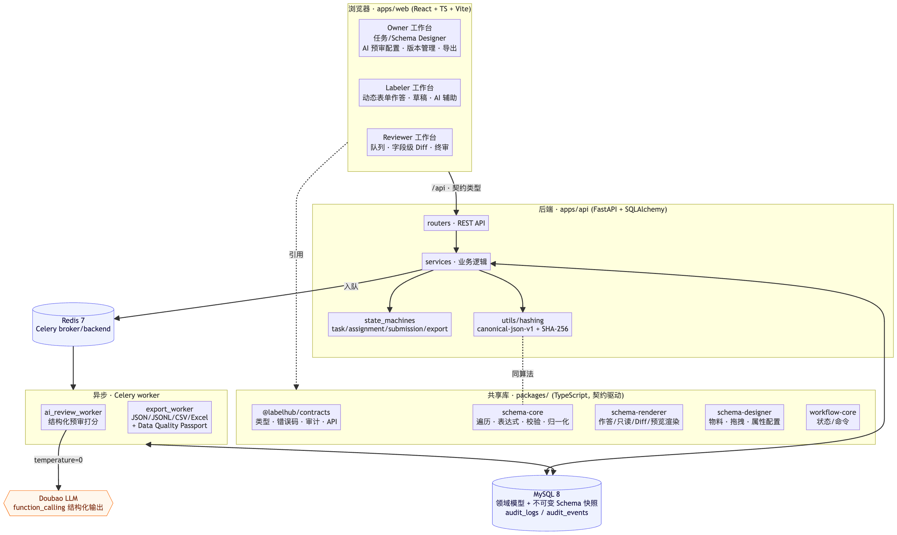
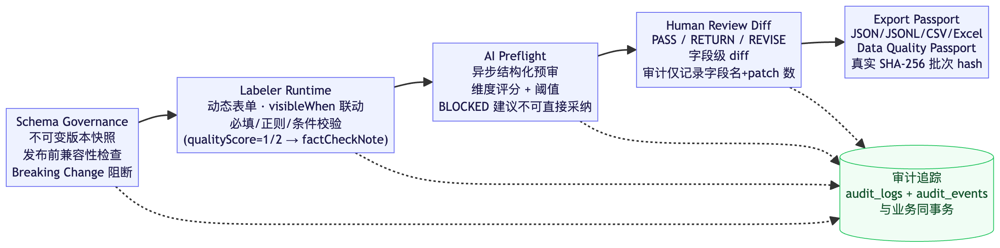
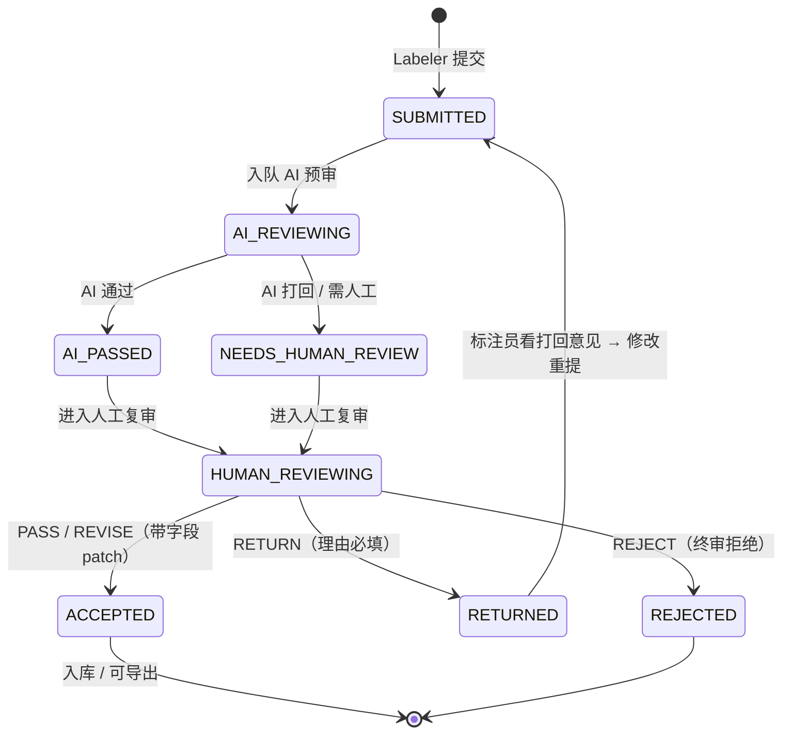
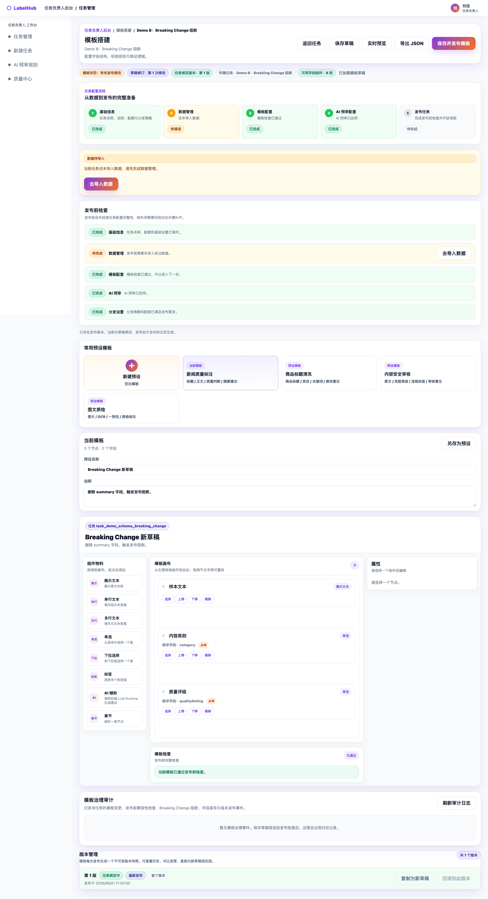
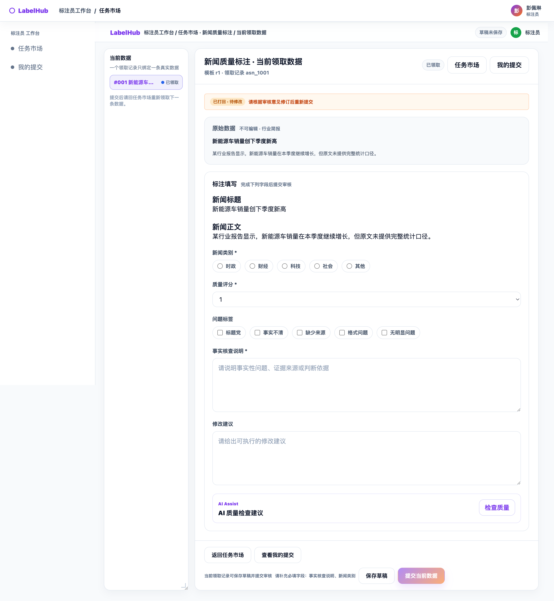
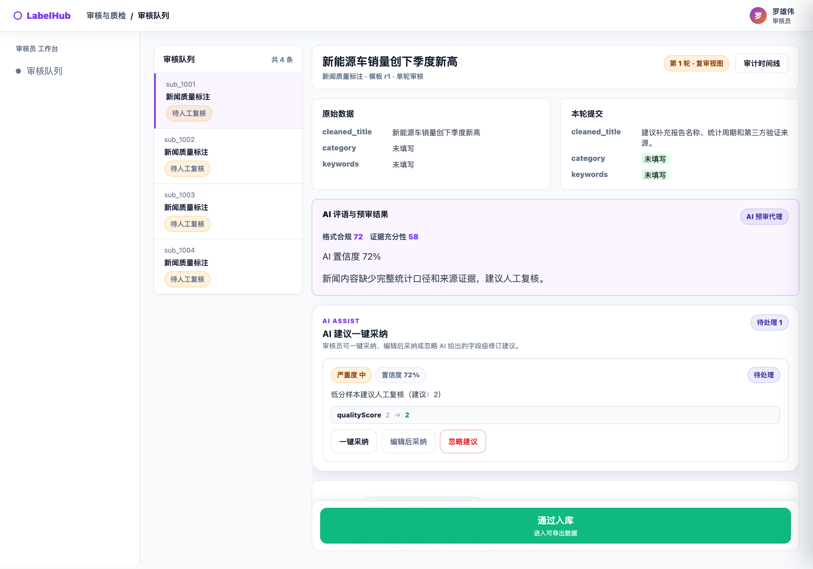

# LabelHub

**LabelHub 是一个 Schema-driven 的 AI 数据标注与质量治理平台。**

它支持任务负责人（Owner）、标注员（Labeler）和审核员（Reviewer）三类角色，覆盖任务配置、Schema 模板搭建、动态标注、AI 辅助质量检查、人工审核、审计追踪和质量导出等流程。整个系统围绕同一套共享契约协作：标注结构由版本化 Schema 驱动，AI 以受校验约束的方式介入，质量决策全程留痕。

> Monorepo 结构：`apps/web`（前端）、`apps/api`（后端 API + Celery worker）、`packages/*`（contracts / schema-core / schema-compiler / schema-renderer / schema-designer / workflow-core 共享库）。

---

## 0. 课题要求对照（4.1–4.6 + 验收标准）

> 面向验收的功能完备性自检。每一行对应课题《核心功能需求》的一条，给出实现位置与演示入口。

| 课题要求 | 实现情况 | 代码位置 / 演示入口 |
| --- | --- | --- |
| **4.1 任务管理**：状态机（草稿/发布中/已暂停/已结束）、富文本说明、标签、奖励、配额、截止时间、分发策略 | ✅ 状态机 `DRAFT/PUBLISHED/PAUSED/ENDED/ARCHIVED`；**三种分发策略（先到先得 / 指派 / 配额抢单）全部实现**（课题仅要求任选其一） | `apps/api/app/models/task.py`、`schemas/task.py`；`/owner/tasks` |
| 数据集导入 **JSON / JSONL / Excel**、预览 | ✅ 三格式导入 + 题目预览 | `apps/api/app/routers/dataset.py`；`/owner/tasks/:id/dataset` |
| **4.2 动态表单 Designer/Renderer**（核心难点）：物料→画布→属性面板、可序列化 JSON Schema、Designer 与 Labeler 同源渲染 | ✅ Designer / Renderer 解耦；物料覆盖单行/多行/单选/多选/标签/富文本/文件图片上传/JSON 编辑器/LLM 交互组件/ShowItem | `packages/schema-designer`、`packages/schema-renderer`；`/owner/tasks/:id/designer` |
| 进阶：字段联动、自定义校验、分组容器 + 多 Tab | ✅ `visibleWhen/disabledWhen/linkageRules` 编译为 Formily reactions；必填/长度/正则/自定义校验；多 Tab 容器布局 | `packages/schema-compiler`、`packages/schema-renderer` |
| **4.3 标注员工作台**：任务广场、作答、草稿自动保存、提交校验、题目级 LLM 辅助、我的数据 | ✅ 任务广场（搜索/筛选/卡片）；**领取制队列**（一次领取一条数据，提交后回广场领下一条）；草稿真实防抖自动保存；运行时提交校验；题目级 LLM 辅助；「我的提交」状态统计 | `apps/web/src/features/labeler`；`/labeler/tasks`、`/labeler/workspace/:id`、`/labeler/submissions` |
| **4.4 AI 预审 Agent**（核心难点）：可配置 Prompt + 评分维度、异步入队、Function Calling 结构化输出、失败重试 + 幂等、结果可见可追溯 | ✅ 维度/阈值/权重可配置；Celery 异步队列；`FUNCTION_CALLING` 结构化输出（非裸文本解析）；`retry_count` 重试 + 幂等键；AI 评语与原始 Prompt 可在审核台查看 | `apps/api/app/services/review_domain.py`、`worker/ai_review_worker.py`；`/owner/ai-config` |
| **4.5 多角色审核流转**：`PASS/RETURN/REVISE` 状态机、迁移可追溯（审计）、批量操作、打回附理由 + 上一轮意见可见、第 1/2 轮 diff | ✅ 结构化决策流；批量审核 `BatchReviewRequest`；`RETURN` 必填理由、Labeler 可见上轮意见；`REVIEW_DIFF_GENERATED` 字段级 diff 审计 | `apps/api/app/routers/review.py`、`services/review_domain.py`；`/reviewer/items` |
| **4.6 多格式导出**：JSON / JSONL / CSV / Excel、异步导出 + 下载历史、字段映射可配置 | ✅ 四格式真实生成；Celery 异步导出；字段映射（选字段 / 重命名 / 是否含审核记录） | `apps/api/app/worker/export_worker.py`、`services/export_domain.py`；`/owner/tasks/:id/export` |
| **工程质量（25%）**：TypeScript 全栈类型、单测/集成测试、README + 部署文档 | ✅ `@labelhub/contracts` 单一类型来源（无大量 any）；**后端 pytest 170 passed、端到端 e2e 21/21、共享库/前端 126 个测试文件全绿**；`docs/deployment.md` 部署文档 | `npm run test`、`pytest -m "not integration"`、`scripts/e2e_test.sh` |
| **产品体验（15%）**：视觉统一、错误友好、操作可逆、1280×800 & 1920×1080 | ✅ 草稿自动保存 + 可逆操作；人话错误提示（不暴露工程词）；响应式（70+ 媒体查询，移动端适配为加分项） | — |

> 答辩**提交物清单**（源码 Monorepo / 演示视频 / 架构图 / AI Coding 过程记录 / Demo 截图 / 可访问演示环境说明 / API 文档）见 [`submission/README.md`](./submission/README.md)。

---

## 1. 项目解决的问题

数据标注生产中有三个反复出现的难题：

1. **如何配置不同任务的标注结构？** 不同任务的字段、选项、必填和联动规则各不相同，硬编码表单无法复用。
2. **如何让 AI 参与质量检查，但不绕过校验规则？** AI 建议如果直接覆盖人工答案，会破坏数据的可信度和模板约束。
3. **如何在数据交付前追踪质量决策和审核证据？** 交付的数据需要能回答"这条数据为什么通过、由谁审核、AI 给过什么意见"。

LabelHub 对应的三个回答：

1. **Schema Governance** —— 版本化、可治理的动态标注结构。
2. **AI suggestedPatch + preflight** —— AI 只给字段级建议，应用前必须通过确定性预检查。
3. **Quality Evidence Chain** —— 审计、AI 预审、审核决策、导出护照共同构成可追踪的质量证据链。

---

## 2. 核心亮点

- **三角色协作流程**：Owner / Labeler / Reviewer 围绕同一任务与同一提交对象形成闭环。
- **Schema-driven 动态标注表单**：标注页面由版本化 Schema 在 runtime 动态渲染，而非硬编码。
- **Schema Version Management**：已发布版本不可变快照、版本历史、兼容性检查（compatibility check）、破坏性变更阻断（breaking change blocking）、历史保留式回滚（history-preserving rollback）、"需要迁移"预览（migration required preview）。
- **AI Assist**：字段级 `suggestedPatch` + 确定性 `preflight` 检查（`SAFE / WARNING / BLOCKED`）。
- **Reviewer decision flow**：`PASS / RETURN / REVISE` 结构化决策；`RETURN` 必填理由，`REVISE` 记录字段级 patches。
- **质量治理三件套**：Quality Center、Audit Trail、Export Passport（Data Quality Passport）。
- **AI Review 配置**：可配置 Prompt、评分维度、阈值，权重通过滑动条自动归一化为 1。

> **能力边界说明**：本仓库已实现兼容性检查、breaking change 阻断、migration required 预览和历史保留式回滚。但 **持久化的后端 migration execution pipeline、历史答卷批量迁移、migration approval workflow 属于后续计划，未作为已完成能力交付**（详见 §10）。

---

## 3. 系统架构

LabelHub 是 monorepo 全栈架构：浏览器端三角色工作台（`apps/web`）通过**契约化的 REST API** 访问后端（`apps/api`），后端把 AI 预审与导出这类耗时任务交给 **Celery worker** 异步处理；所有共享类型、Schema 内核与渲染能力沉淀在 `packages/*`，被前端、后端、Worker 与测试**共同引用同一份契约**。

### 3.1 总览图



> 源文件（Mermaid，可在 <https://mermaid.live> 重新导出）：[`submission/architecture.mmd`](submission/architecture.mmd)。

### 3.2 分层职责

| 层 | 模块 | 职责 |
|---|---|---|
| 前端 | `apps/web`（React 19 + TS + Vite） | 三角色工作台（Owner / Labeler / Reviewer）；标注页由版本化 Schema 运行时动态渲染 |
| 后端 API | `apps/api`（FastAPI + SQLAlchemy） | REST 路由 → 业务服务 → **命令驱动状态机**；`canonical-json-v1 + SHA-256` 哈希 |
| 异步 Worker | `apps/api/app/worker`（Celery） | `ai_review_worker` 结构化预审打分、`export_worker` 多格式导出 + Data Quality Passport；与 API 共用同一镜像 |
| 共享契约 | `@labelhub/contracts` | 前端 / 后端 / Worker / Mock / 测试的**唯一类型来源**（状态、错误码、审计、API shape） |
| Schema 内核 | `@labelhub/schema-core` | 遍历 / 表达式 / 校验 / 归一化 / 兼容性 / 版本冻结的确定性纯函数（不访问数据库） |
| 渲染层 | `@labelhub/schema-renderer` | 动态表单 runtime + AI preflight；作答 / 只读 / Diff / 预览渲染 |
| 设计器 | `@labelhub/schema-designer` | Owner 侧物料 / 拖拽 / 属性 · 校验 · 联动配置 |
| 编译 / 工作流 | `@labelhub/schema-compiler`、`workflow-core` | Schema → Formily reactions 编译；状态 / 命令 |
| 存储 | MySQL 8 / Redis 7 | 领域模型 + 不可变 Schema 快照 + `audit_logs/audit_events`；Celery broker/backend |
| 大模型 | Doubao LLM | `function_calling` 结构化输出，`temperature=0` 提升评分稳定性 |

> **MSW Mock 层**（`apps/web/src/mocks`）：真实后端就绪前支持前端演示与并行开发，复用契约类型而非重新定义。

### 3.3 技术栈

| 领域 | 选型 |
|---|---|
| 前端 | React 19、TypeScript 5、Vite 5、Formily 运行时 |
| 后端 | Python 3.11、FastAPI、SQLAlchemy、Alembic、Pydantic |
| 异步 / 队列 | Celery + Redis 7 |
| 数据库 | MySQL 8 |
| 大模型 | 豆包 Doubao（OpenAI 兼容，function calling） |
| 测试 | `node:test`（共享库）、Vitest / RTL（web）、pytest（后端）、e2e 脚本 |

### 3.4 端到端数据质量主线

设计主线：**结构先可信 → 运行时校验 → AI 不绕过规则 → 人工留痕 → 交付带证据链**。



```txt
Schema Governance → Labeler Runtime → AI Preflight → Human Review Diff → Export Passport
       └──────────────── 全程写入 audit_logs / audit_events（与业务同事务）────────────────┘
```

### 3.5 审核工作流状态机（对应 4.5 长链路状态流转）

提交对象（Submission）的状态迁移全程可追溯，每一步与审计**同事务**写入：



> **决策语义**：Reviewer UI 提供 `PASS / RETURN / REVISE` 三种操作——`REVISE` 是「修订后通过」，携带字段级 patches，底层以 `PASS + patches` 落库；契约层的人工决策枚举为 `PASS / RETURN / REJECT`（`REJECT` 为终审拒绝）。状态值取自后端 `SubmissionStatus`，所有迁移写入审计。

---

## 4. 仓库结构

```
apps/
  web/        前端应用（React + Vite）
  api/        后端 API 服务（FastAPI），同一镜像启动 Celery worker

packages/
  contracts/        共享类型与 API 契约（唯一类型来源）
  schema-core/      Schema 版本、兼容性、字段废弃与迁移计划纯函数
  schema-compiler/  Schema 编译相关能力
  schema-renderer/  Runtime renderer 与 AI preflight
  schema-designer/  Owner 侧 Schema 编辑工具
  workflow-core/    工作流相关核心能力

docs/
  架构、Schema Governance、交付说明、AI Coding 过程记录（AI_CODING_PROCESS.md）

submission/
  答辩交付物索引（submission/README.md）
```

> 说明：worker 不是独立目录，而是基于 `apps/api` 镜像运行的 Celery 进程（见 `docker-compose.yml` 的 `worker` 服务）。

---

## 5. 主要模块

### Owner —— 任务负责人后台（`apps/web/src/features/owner`）

- 任务管理与任务配置引导
- 数据集导入 / 预览
- Schema Designer（模板设计）
- Schema Version Management（版本状态条、兼容性 badge、发布结论 banner）
- AI 预审配置（Prompt / 维度 / 阈值 / 权重 slider）
- Quality Center
- 导出 / Quality Passport
- Audit timeline



### Labeler —— 标注员工作台（`apps/web/src/features/labeler`）

- 任务市场
- 标注工作台（Dynamic Schema Runtime 渲染）
- 草稿自动保存
- 提交校验
- AI Assist Panel
- 被打回任务的继续修改



### Reviewer —— 审核员工作台（`apps/web/src/features/reviewer`）

- 审核队列
- 批量领取 / 批量审核
- 审核详情
- `PASS / RETURN / REVISE` 决策（`RETURN` 必填理由，`REVISE` 字段级修订）
- AI 预审结果查看



> 更多界面见 [`submission/screenshots/`](submission/screenshots/)（三角色 6 张关键页 + 索引）。

### Shared Governance Layer —— 共享治理层（`packages/*`）

- contracts（共享类型与契约）
- schema runtime（动态渲染）
- compatibility check（兼容性检查）
- preflight（AI 建议预检查）
- audit（审计）
- export quality evidence（导出质量证据）

---

## 6. 本地启动指引

### 方式一：Docker Compose（推荐，含真实后端）

```bash
# 0) 准备环境变量
cp .env.example .env          # 按需填 DOUBAO_API_KEY / DOUBAO_MODEL 等

# 1) 构建并启动全部服务（web / api / worker / mysql / redis）
docker compose up -d --build

# 2) 数据库迁移
docker compose exec -w /workspace/apps/api api alembic upgrade head

# 3) 灌入演示数据
docker compose exec -w /workspace/apps/api api python scripts/seed_demo.py
docker compose exec -w /workspace/apps/api api python scripts/seed_competition.py
```

Compose 包含以下服务：`web`、`api`、`worker`、`mysql`、`redis`。

前端访问 `http://localhost:5173/`。web 默认走真实后端（`VITE_ENABLE_MSW=false`，Vite `/api` 代理至 `api:3000`）。

> **环境变量**：复制 `.env.example` 为 `.env` 并填写本地配置。**不要提交真实 API key、token 或 secret。**

### 方式二：前端 + 共享库本地开发

```bash
# 共享库（packages/*）依赖与检查
npm install
npm run typecheck
npm run test

# 前端应用（apps/web 为独立 npm 项目）
cd apps/web
npm install
npm run dev          # Vite 开发服务器
```

如需纯前端演示（不依赖后端），可启用 MSW Mock：

```bash
# apps/web 环境
VITE_ENABLE_MSW=true
```

---

## 7. 测试与验证命令

```bash
# 共享库：根目录 workspace 统一检查（contracts / schema-core / schema-compiler /
# schema-renderer / schema-designer / workflow-core）
npm run typecheck
npm run test

# 单独运行某个共享库测试
npm run test:contracts
npm run test:schema-core
npm run test:schema-renderer

# 前端应用
cd apps/web
npm run typecheck
npm run build

# 后端（在 Docker 环境内）
docker compose exec -w /workspace/apps/api api pytest -m "not integration" -q
bash apps/api/scripts/e2e_test.sh

# 交付前检查 whitespace / conflict markers
git diff --check
```

---

## 8. 演示账号与演示路由

演示账号（由 seed / mock 数据提供，也可通过登录页的角色入口直接进入对应工作台）：

| 角色 | 账号 | 密码 |
| --- | --- | --- |
| Owner | `owner@labelhub.com` | `password123` |
| Labeler | `labeler@labelhub.com` | `password123` |
| Reviewer | `reviewer@labelhub.com` | `password123` |

真实演示路由（来自 `apps/web/src/app/routes.tsx`）：

```txt
Owner:
- /owner/tasks                                            任务管理
- /owner/ai-config                                        AI 预审规则（含权重 slider）
- /owner/quality                                          Quality Center
- /owner/tasks/:taskId/designer                           Schema Designer
- /owner/tasks/:taskId/dataset                            数据集
- /owner/tasks/:taskId/export                             导出

  Schema Governance 演示任务（mock）:
- /owner/tasks/task_demo_schema_breaking_change/designer
- /owner/tasks/task_demo_schema_migration_required/designer
- /owner/tasks/task_demo_schema_deprecation/designer
- /owner/tasks/task_demo_schema_safe_publish/designer

Labeler:
- /labeler/tasks                                          任务市场
- /labeler/workspace/asn_1001                             标注工作台
- /labeler/submissions                                    我的提交

Reviewer:
- /reviewer/items                                         审核队列
- /reviewer/items/:submissionId                           审核详情
```

---

## 9. 关键设计取舍

### 9.1 Contract-first development

共享契约定义在 `packages/contracts` 中，各层统一引用 `@labelhub/contracts`。这样可以避免重复定义状态码、审核决策和 API shape，保证前端、后端、Worker、Mock 对同一概念的理解一致。

### 9.2 Schema-driven runtime

标注页面不是硬编码表单，而是由版本化 Schema 动态生成。字段显示、必填和校验规则在 runtime 中解析（`packages/schema-renderer`、`packages/schema-core`）。

### 9.3 Schema version freeze

已发布的 Schema 是不可变快照。历史任务和提交绑定到当时的 `schemaVersionId`，避免后续模板修改破坏历史数据。核心原则：默认不迁移，每一次变更都可被识别，每一次迁移都应留下痕迹。

### 9.4 AI as governed suggester

AI 的 `suggestedPatch` 不能直接覆盖答案。应用前必须经过确定性的 preflight 检查（检查字段是否存在、是否产生新的必填缺失、是否符合 Schema Runtime 联动逻辑）；被阻断的建议可以被解释和忽略，但不会被静默应用。

### 9.5 Human review as decision flow

审核不是简单按钮，而是 `PASS / RETURN / REVISE` 结构化决策流。`RETURN` 必须填写理由；`REVISE` 会记录字段级 patches。

### 9.6 Quality evidence chain

Audit、AI precheck、Reviewer decision 和 Export Passport 共同形成可追踪的质量证据链，使交付数据可以回溯其质量与审核过程。

### 9.7 No fake migration execution

系统支持兼容性检查和 "migration required" 预览，`schema-core` 提供了 plan / dry-run / execute 的纯函数构建块。但 **持久化的后端 migration execution pipeline 属于后续计划，不被描述为已完成能力。**

---

## 10. 当前完成状态

### 已完成

- Owner / Labeler / Reviewer 三角色工作流
- Dynamic Schema Designer 与 Runtime
- Schema Version Management UI
- 版本历史与不可变快照
- 兼容性检查与 breaking change 阻断
- Labeler / Reviewer AI Assist preflight
- Reviewer decision flow（PASS / RETURN / REVISE）
- Quality Center / Export Passport / Audit
- AI Review 配置与自动归一化权重 slider

### 后续计划

- 后端 migration execution pipeline（持久化、修改数据库的迁移执行）
- 历史答卷批量迁移（historical answers batch migration）
- migration approval workflow（Dry Run → 审批 → 执行 → 不可变记录）
- 更完整的生产级权限管理
- 更细粒度的质量分析
- 部署监控

---

## 11. 相关交付文档

| 文档 | 用途 |
| --- | --- |
| [labelhub-architecture-contract.md](./labelhub-architecture-contract.md) | 顶层架构契约（v1.1），各层共同依据 |
| [AI_CODING_RULES.md](./AI_CODING_RULES.md) | AI Coding 统一规则（contract-driven、禁止事项、验证要求） |
| [docs/LabelHub_Final_Delivery.md](./docs/LabelHub_Final_Delivery.md) | 最终交付说明 |
| [docs/LabelHub_Delivery_Runbook.md](./docs/LabelHub_Delivery_Runbook.md) | 交付 / 部署 runbook |
| [docs/LabelHub_Schema_Version_Management.md](./docs/LabelHub_Schema_Version_Management.md) | Schema 版本管理实施规格 |
| [docs/AI_CODING_PROCESS.md](./docs/AI_CODING_PROCESS.md) | AI Coding 过程与开发记录 |
| [submission/README.md](./submission/README.md) | 答辩交付物索引 |

---

## 12. 安全说明

- 不要提交 API keys、tokens 或 secrets。
- 不要暴露私有 LLM provider credentials。
- 使用本地 `.env` 文件管理密钥（参考 `.env.example`）。

---

## 13. 最终交付说明

- 建议最终交付分支：PR 合并后的 `dev` 或 `main`。
- 当前稳定集成分支：`integration/joint-test`。
- 交付固定点 tag：`final-delivery-0610`（含 2026-06-10 全部真机关键修复）；历史阶段 tag：`stable-after-owner-ai-config-polish-0610`。
