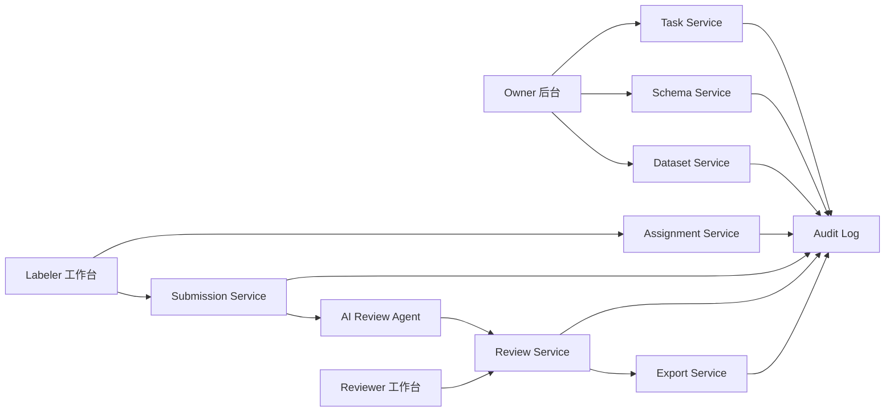
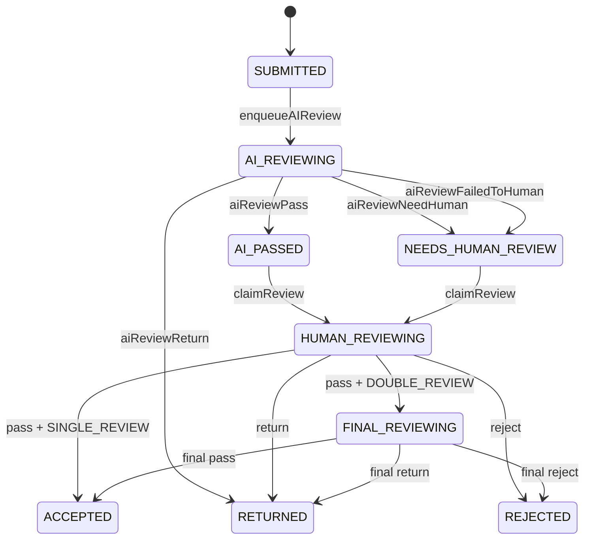

# LabelHub 架构与动态 Schema 契约 v1.1

契约协议版本：`1.1`  
适用对象：前端 Designer、前端 Renderer、后端 API、AI Review Agent、导出服务、数据库建模、自动化测试  
核心目标：用一套无歧义、可实现、可测试的契约，支撑「Owner 创建任务 -> 搭建动态 schema -> 导入数据集 -> 发布任务 -> Labeler 领取并提交 -> AI Review Agent 结构化预审 -> Reviewer 人工审核 -> 通过数据多格式导出」完整链路。

## 1. 设计目标

LabelHub 是面向 AI 数据生产的全链路标注平台，不是普通表单系统。架构契约遵守以下原则：

1. Schema 是前后端共同语言：Designer 产出 JSON schema，Renderer 直接消费同一份 schema，后端用同一份 schema 做权威校验、快照、导出映射和审核上下文组装。
2. 发布后的 schema version 不可变：任务发布前必须冻结 schema draft，生成不可变 `schemaVersionId` 和 `schemaVersionNo`。
3. 状态迁移必须 command-driven：任务、题目、分配、草稿、提交、AI 审核、人工审核、导出都通过 command 迁移，并写入 audit log。
4. 前端负责交互体验，后端负责裁决：前端可做即时校验和预览，后端必须做权限、状态、schema、幂等、审计的权威判断。
5. AI Review Agent 是系统角色：Prompt、模型参数、输入 hash、输出 hash、失败重试和人工兜底必须可追溯。
6. 存储分层：强结构字段进入关系表；schema、答案、审核结果、导出映射等灵活结构进入 JSON 字段；文件只保存引用。
7. 契约优先于实现：任何模块实现与本文冲突时，以本文为准。

## 2. 系统边界



核心服务边界：

- Task Service：任务基础信息、配额、截止时间、分发策略、任务发布状态。
- Schema Service：schema draft、schema version、组件注册、schema 校验、版本冻结。
- Dataset Service：数据集导入、题目预览、题目状态维护。
- Assignment Service：领取、指派、草稿锁、过期释放。
- Submission Service：提交校验、提交尝试次数、AI 审核入队。
- Review Service：AI 结果、人工审核、终审、批量操作、审核补丁。
- Agent Service：异步队列、Prompt 渲染、LLM 调用、结构化输出、失败重试。
- Export Service：字段映射、异步导出、下载历史。
- Audit Service：统一记录关键 command 和状态迁移。

## 3. 全局类型、错误码与幂等规则

```ts
export type ID =
  | `usr_${string}`
  | `task_${string}`
  | `schema_${string}`
  | `sv_${string}`
  | `item_${string}`
  | `asn_${string}`
  | `sub_${string}`
  | `rev_${string}`
  | `job_${string}`
  | `file_${string}`
  | `audit_${string}`
  | `cfg_${string}`
  | `prompt_${string}`
  | `llm_${string}`;

export type ISODateTime = string; // UTC ISO-8601 字符串

export type Role = "OWNER" | "LABELER" | "REVIEWER" | "SYSTEM" | "ADMIN";

export interface Actor {
  id: ID;
  role: Role;
  displayName: string;
}

export interface PageResult<T> {
  items: T[];
  page: number;
  pageSize: number;
  total: number;
}

export type ErrorCode =
  | "SCHEMA_INVALID"
  | "SCHEMA_VERSION_IMMUTABLE"
  | "SCHEMA_DRAFT_CONFLICT"
  | "UNKNOWN_NODE_TYPE"
  | "UNKNOWN_VALIDATION_RULE"
  | "FIELD_NAME_DUPLICATED"
  | "NODE_ID_DUPLICATED"
  | "INVALID_JSON_PATH"
  | "INVALID_EXPRESSION"
  | "VALIDATION_FAILED"
  | "INVALID_STATE_TRANSITION"
  | "PERMISSION_DENIED"
  | "IDEMPOTENCY_CONFLICT"
  | "AI_REVIEW_FAILED"
  | "SCHEMA_GENERATION_FAILED"
  | "EXPORT_MAPPING_INVALID"
  | "FILE_NOT_READY"
  | "FILE_PERMISSION_DENIED"
  | "REVIEW_REASON_REQUIRED"
  | "REVISION_CONFLICT"
  | "RESOURCE_NOT_FOUND";

export interface ApiError {
  code: ErrorCode;
  message: string;
  details?: unknown;
  traceId: string;
}
```

幂等规则：

- 所有写接口必须支持 `Idempotency-Key`。
- 幂等作用域为 `actorId + method + path + Idempotency-Key`。
- 幂等记录默认保留 24 小时。
- 相同 key 与相同 request body 必须返回同一 response snapshot 或同一 resource id 对应的最新安全快照。
- 相同 key 与不同 request body 必须返回 `IDEMPOTENCY_CONFLICT`。
- 状态迁移 command 必须幂等；重复 command 不得重复写业务结果，但可以记录 request trace。
- 幂等记录至少保存 request hash、response snapshot 或 resource id、createdAt、expiresAt。

## 4. 版本语义

v1.1 将版本语义拆成四类，禁止再用单个 `version` 表达多个概念。

```ts
export type ContractVersion = "1.1";

export interface SchemaVersionRef {
  schemaId: ID;
  schemaVersionId: ID;
  schemaVersionNo: number;
}
```

版本字段定义：

- `contractVersion`：契约协议版本，例如 `"1.1"`。
- `schemaVersionNo`：某个任务模板发布出来的第几个版本，例如 `1`、`2`、`3`。
- `schemaDraftRevision`：schema draft 自动保存修订号，用于并发保存冲突检测。
- `schemaVersionId`：已发布 schema snapshot 的不可变数据库 ID。

强制规则：

- draft schema 可以没有 `schemaVersionId` 和 `schemaVersionNo`。
- published schema 必须有 `schemaVersionId` 和 `schemaVersionNo`。
- `Assignment`、`Draft`、`Submission`、`AIReviewJobPayload`、`ReviewDetailResponse`、`ExportJob` 只要引用标注模板，都必须引用 `schemaVersionId`。
- `Task.activeSchemaVersionId` 必须指向一个已发布且不可变的 schema version。
- `schemaDraftRevision` 只能用于草稿并发控制，不得作为发布版本号。

## 5. 运行时上下文与 JsonPath 命名空间

所有 `JsonPath` 必须从统一 `LabelHubRuntimeContext` 出发。禁止使用裸路径、未带命名空间的 sourcePayload 路径，以及把 item 作为模糊根路径的写法。

```ts
export type JsonPath = string; // 统一采用 $.namespace.a.b[0].c 风格

export interface LabelHubRuntimeContext {
  task: TaskRuntimeContext;
  schema: SchemaRuntimeContext;
  item: DatasetItemRuntimeContext;
  answers: AnswerPayload;
  review?: ReviewRuntimeContext;
  system: SystemRuntimeContext;
  meta?: Record<string, unknown>;
}

export interface TaskRuntimeContext {
  id: ID;
  title: string;
  status: TaskStatus;
  activeSchemaVersionId: ID;
}

export interface SchemaRuntimeContext {
  schemaId: ID;
  schemaVersionId: ID;
  schemaVersionNo: number;
  contractVersion: ContractVersion;
}

export interface DatasetItemRuntimeContext {
  id: ID;
  externalKey?: string;
  sourcePayload: Record<string, unknown>;
}

export interface ReviewRuntimeContext {
  latestDecision?: ReviewDecision;
  aiResult?: AIReviewResult;
  comments?: ReviewComment[];
  patches?: ReviewPatch[];
}

export interface SystemRuntimeContext {
  actor: Actor;
  role: Role;
  now: ISODateTime;
  timezone?: string;
}
```

允许的命名空间：

- `$.task.xxx`
- `$.schema.xxx`
- `$.item.sourcePayload.xxx`
- `$.answers.xxx`
- `$.review.xxx`
- `$.system.xxx`
- `$.meta.xxx`
- `$.output.xxx`，仅允许用于 LLM output binding。

JsonPath 校验规则：

- ShowItem、Expression、LLM Assist input、Export mapping 不允许使用 `$.output.xxx`。
- LLM output binding 的 `from` 必须使用 `$.output.xxx`。
- item 相关路径只能读取 `sourcePayload` 下的数据，不允许把 item 当作模糊对象根路径读取。
- 路径引用的 `$.answers.xxx` 必须对应存在的 `FieldNode.name`，除非该路径用于历史数据兼容读取。

## 6. 领域模型

### 6.1 Task

```ts
export type TaskStatus = "DRAFT" | "PUBLISHED" | "PAUSED" | "ENDED" | "ARCHIVED";

export interface Task {
  id: ID;
  title: string;
  description: string;
  instructionRichText?: RichTextDocument;
  tags: string[];
  rewardRule?: RewardRule;
  quota: {
    total: number;
    perLabeler?: number;
  };
  deadlineAt?: ISODateTime;
  distributionStrategy: DistributionStrategy;
  reviewPolicy: ReviewPolicy;
  status: TaskStatus;
  activeSchemaVersionId?: ID;
  ownerId: ID;
  createdAt: ISODateTime;
  updatedAt: ISODateTime;
}

export type DistributionStrategy =
  | { type: "FIRST_COME_FIRST_SERVED" }
  | { type: "ASSIGNMENT"; assigneeIds: ID[] }
  | { type: "QUOTA_CLAIM"; claimBatchSize: number };

export interface RewardRule {
  unit: "PER_ACCEPTED_ITEM" | "PER_SUBMISSION" | "FIXED";
  amount: number;
  currency?: string;
}
```

### 6.2 DatasetItem

```ts
export type DatasetItemStatus = "AVAILABLE" | "LOCKED" | "COMPLETED" | "DISABLED";

export interface DatasetItem {
  id: ID;
  taskId: ID;
  externalKey?: string;
  sourcePayload: Record<string, unknown>;
  status: DatasetItemStatus;
  currentAssignmentId?: ID;
  createdAt: ISODateTime;
  updatedAt: ISODateTime;
}
```

### 6.3 Assignment、Draft、Submission

```ts
export type AssignmentStatus =
  | "CLAIMED"
  | "DRAFTING"
  | "SUBMITTED"
  | "RETURNED"
  | "ACCEPTED"
  | "CANCELED"
  | "EXPIRED";

export interface Assignment {
  id: ID;
  taskId: ID;
  itemId: ID;
  labelerId: ID;
  schemaVersionId: ID;
  status: AssignmentStatus;
  lockedUntil?: ISODateTime;
  latestSubmissionId?: ID;
  createdAt: ISODateTime;
  updatedAt: ISODateTime;
}

export interface Draft {
  assignmentId: ID;
  schemaVersionId: ID;
  answers: AnswerPayload;
  clientRevision: number;
  serverRevision: number;
  validationErrors?: ValidationError[];
  savedAt: ISODateTime;
}

export type SubmissionStatus =
  | "SUBMITTED"
  | "AI_REVIEWING"
  | "AI_PASSED"
  | "NEEDS_HUMAN_REVIEW"
  | "HUMAN_REVIEWING"
  | "FINAL_REVIEWING"
  | "RETURNED"
  | "ACCEPTED"
  | "REJECTED";

export interface Submission {
  id: ID;
  assignmentId: ID;
  taskId: ID;
  itemId: ID;
  labelerId: ID;
  schemaVersionId: ID;
  attemptNo: number;
  answers: AnswerPayload;
  status: SubmissionStatus;
  validationSnapshot: ValidationResult;
  createdAt: ISODateTime;
  updatedAt: ISODateTime;
}

export type AnswerPayload = Record<string, unknown>;
```

提交规则：

- `Submission.answers` 只能包含可提交的 `FieldNode.name`，不得包含 ShowItem、Container、LLMAssist。
- 每次打回后重新提交必须生成新的 `Submission` 或新的 `attemptNo` 快照，不能覆盖历史提交。
- 后端提交时必须使用 `schemaVersionId` 对 answers 做权威校验。

## 7. 动态 Schema 契约

```ts
export type SchemaStatus = "DRAFT" | "PUBLISHED" | "DEPRECATED";

export interface LabelHubSchema {
  contractVersion: ContractVersion;
  schemaId: ID;
  schemaVersionId?: ID;
  schemaVersionNo?: number;
  schemaDraftRevision?: number;
  status: SchemaStatus;
  meta: SchemaMeta;
  root: ContainerNode;
  definitions?: Record<string, unknown>;
}

export interface SchemaMeta {
  name: string;
  description?: string;
  taskId: ID;
  authorId: ID;
  createdAt: ISODateTime;
  updatedAt: ISODateTime;
  publishedAt?: ISODateTime;
  deprecatedAt?: ISODateTime;
}

export interface SchemaVersion {
  id: ID;
  schemaId: ID;
  taskId: ID;
  schemaVersionNo: number;
  contractVersion: ContractVersion;
  snapshot: PublishedLabelHubSchema;
  createdAt: ISODateTime;
}

export interface PublishedLabelHubSchema extends LabelHubSchema {
  schemaVersionId: ID;
  schemaVersionNo: number;
  status: "PUBLISHED";
}

export type SchemaNode = FieldNode | ContainerNode | ShowItemNode | LLMAssistNode;
```

发布规则：

- `schema_versions.schema_json` 必须保存完整 `PublishedLabelHubSchema`。
- `schemaVersionNo` 按 task 维度递增。
- `schemaDraftRevision` 每次保存 draft 递增，发布后不会进入提交链路并发判断。
- 已发布 schema 不允许原地修改，只能基于 draft 发布新 `schemaVersionId`。

## 8. 节点类型与字段子类型

```ts
export type NodeType =
  | InputFieldType
  | ChoiceFieldType
  | UploadFieldType
  | DataFieldType
  | ShowItemType
  | ContainerType
  | "llm.assist";

export type InputFieldType = "input.text" | "input.textarea" | "input.richtext";

export type ChoiceFieldType = "choice.radio" | "choice.checkbox" | "choice.select" | "choice.tags";

export type UploadFieldType = "upload.file" | "upload.image";

export type DataFieldType = "data.json";

export type ShowItemType =
  | "show.text"
  | "show.richtext"
  | "show.image"
  | "show.file"
  | "show.json";

export type ContainerType = "container.group" | "container.tabs" | "container.section";

export type AnswerFieldType =
  | InputFieldType
  | ChoiceFieldType
  | UploadFieldType
  | DataFieldType;

export interface BaseNode {
  id: string; // schema 内稳定唯一，禁止使用数组下标
  type: NodeType;
  title: string;
  description?: string;
  hidden?: boolean;
  disabled?: boolean;
  visibleWhen?: Expression;
  disabledWhen?: Expression;
  ui?: UIOptions;
  analyticsKey?: string;
}

export interface BaseFieldNode extends BaseNode {
  kind: "FIELD";
  type: AnswerFieldType;
  name: string; // 写入 answers 的业务 key，同一 schema version 内唯一
  defaultValue?: unknown;
  required?: boolean;
  preserveWhenHidden?: boolean;
  validateWhenHidden?: boolean;
  submitWhenDisabled?: boolean;
  validations?: ValidationRule[];
}

export interface TextFieldNode extends BaseFieldNode {
  type: "input.text" | "input.textarea";
  placeholder?: string;
  minRows?: number;
  maxRows?: number;
}

export interface RichTextFieldNode extends BaseFieldNode {
  type: "input.richtext";
  placeholder?: string;
  toolbarPreset?: "BASIC" | "FULL";
}

export interface ChoiceFieldNode extends BaseFieldNode {
  type: ChoiceFieldType;
  options: Option[];
  multiple?: boolean;
  allowCustom?: boolean;
}

export interface UploadFieldNode extends BaseFieldNode {
  type: UploadFieldType;
  accept?: string[];
  maxSizeMB?: number;
  maxCount?: number;
}

export interface JsonFieldNode extends BaseFieldNode {
  type: "data.json";
  jsonSchema?: JsonSchemaLike;
  editorMode?: "TREE" | "CODE";
}

export type FieldNode =
  | TextFieldNode
  | RichTextFieldNode
  | ChoiceFieldNode
  | UploadFieldNode
  | JsonFieldNode;

export interface ShowItemNode extends BaseNode {
  kind: "SHOW_ITEM";
  type: ShowItemType;
  sourcePath: JsonPath;
  transform?: TransformSpec;
}

export interface LLMAssistNode extends BaseNode {
  kind: "LLM_ASSIST";
  type: "llm.assist";
  trigger: "MANUAL" | "ON_FIELD_CHANGE";
  promptTemplateId?: ID;
  promptTemplate?: string;
  modelPolicyId?: string;
  inputBindings: Record<string, JsonPath>;
  outputMode: "SUGGESTION" | "PREFILL" | "STRUCTURED";
  outputSchema?: JsonSchemaLike;
  outputBindings?: LLMOutputBinding[];
  rateLimit?: {
    maxCallsPerAssignment: number;
  };
}

export interface ContainerNode extends BaseNode {
  kind: "CONTAINER";
  type: ContainerType;
  name?: string;
  children: SchemaNode[];
  layout?: LayoutSpec;
}
```

字段值约定：

| Type | Value Shape | 说明 |
| --- | --- | --- |
| `input.text` | `string` | 单行文本 |
| `input.textarea` | `string` | 多行文本 |
| `input.richtext` | `RichTextDocument` | 富文本 JSON AST |
| `choice.radio` | `string` | 单选值 |
| `choice.checkbox` | `string[]` | 多选值 |
| `choice.select` | `string \| string[]` | 由 `multiple` 决定 |
| `choice.tags` | `string[]` | 标签数组 |
| `upload.file` | `FileRef[]` | 文件引用 |
| `upload.image` | `FileRef[]` | 图片引用 |
| `data.json` | `unknown` | 必须可 JSON 序列化 |

```ts
export interface Option {
  label: string;
  value: string;
  disabled?: boolean;
  color?: string;
}

export interface FileRef {
  fileId: ID;
  name: string;
  mimeType: string;
  size: number;
  url?: string; // 只用于短期展示，持久化以 fileId 为准
}

export interface RichTextDocument {
  type: "doc";
  content: unknown[];
}

export type JsonSchemaLike = Record<string, unknown>;
```

## 9. 节点职责与隐藏字段规则

节点职责：

- FieldNode：唯一可以写入 answers 的节点；使用 `name` 作为 answers 中的业务 key；可以参与 validation、AI review、export；`FieldNode.name` 在同一个 schema version 内必须唯一。
- ShowItemNode：只能从 `LabelHubRuntimeContext` 读取数据；只展示，不写入 answers；不参与提交；可以参与 AI prompt 上下文。
- LLMAssistNode：只能通过后端 LLM Runtime 调用模型；可以返回 suggestion 或 `suggestedPatch`；不能静默修改 answers；所有写入目标字段的操作必须经过用户确认。
- ContainerNode：只负责布局和组织；不写入 answers；不参与 export；只通过 `children` 影响 Renderer 遍历。

隐藏与禁用优先级：

1. `hidden: true` 优先级最高，直接隐藏。
2. `visibleWhen` 决定运行时是否可见。
3. `disabled: true` 优先级高于 `disabledWhen`。
4. `disabledWhen` 决定运行时是否禁用。

提交与校验规则：

- `visibleWhen` 为 false 的字段默认不提交。
- `hidden` 字段默认不触发 required 校验。
- `preserveWhenHidden: true` 时，已有答案值可以保留在 answers 中。
- `validateWhenHidden: true` 时，隐藏字段仍执行 validations。
- disabled 字段默认可展示但不可编辑，不自动清空已有值。
- `submitWhenDisabled: true` 时，disabled 字段可以提交；默认 disabled 字段不作为新增必填输入来源。

## 10. 展示与导出转换

```ts
export type TransformSpec =
  | { type: "TEXT"; fallback?: string }
  | { type: "MARKDOWN" }
  | { type: "JSON_STRINGIFY"; space?: number }
  | { type: "DATE"; format?: string }
  | { type: "FILE_URLS" }
  | { type: "IMAGE_PREVIEW" };
```

规则：

- `TransformSpec` 只能用于展示层和导出层的格式转换。
- `TransformSpec` 不得改变 `sourcePayload` 原始数据。
- Renderer 可以用 `TransformSpec` 展示 ShowItem。
- Export 可以复用 `TransformSpec` 或 `ExportColumn.transform`。

## 11. 表达式契约

字段联动、条件显示、联动校验统一使用可序列化表达式，禁止在 schema 中存储任意 JavaScript 函数。

```ts
export type Expression =
  | { op: "eq" | "ne" | "gt" | "gte" | "lt" | "lte"; left: ExprValue; right: ExprValue }
  | { op: "in" | "notIn"; left: ExprValue; right: ExprValue[] }
  | { op: "empty" | "notEmpty"; value: ExprValue }
  | { op: "and" | "or"; items: Expression[] }
  | { op: "not"; item: Expression };

export type ExprValue =
  | { kind: "path"; path: JsonPath }
  | { kind: "literal"; value: unknown };
```

表达式规则：

- `path` 必须符合 `LabelHubRuntimeContext` 命名空间。
- 后端 schema validate 必须检查表达式引用的字段是否存在。
- 表达式执行失败时，后端必须返回 `INVALID_EXPRESSION` 或 `VALIDATION_FAILED`。

## 12. LLM Assist 输出绑定

```ts
export interface LLMOutputBinding {
  from: JsonPath; // 例如 $.output.summary
  toFieldName: string; // 例如 summary
  mode: "REPLACE" | "APPEND" | "MERGE";
  requireUserConfirm: boolean;
}

export interface LLMRuntimeRequest {
  nodeId: string;
  answers: AnswerPayload;
}

export interface LLMRuntimeResponse {
  output: unknown;
  suggestedPatch?: AnswerPayload;
  callId: ID;
}

export type LLMCallStatus = "PENDING" | "RUNNING" | "SUCCEEDED" | "FAILED";

export interface LLMCallLog {
  id: ID;
  purpose: "LLM_ASSIST" | "AI_REVIEW" | "SCHEMA_GENERATION";
  actorId: ID;
  assignmentId?: ID;
  submissionId?: ID;
  nodeId?: string;
  modelPolicyId: string;
  promptSnapshotHash: string;
  inputHash: string;
  outputHash?: string;
  status: LLMCallStatus;
  errorMessage?: string;
  createdAt: ISODateTime;
  finishedAt?: ISODateTime;
}
```

规则：

- `LLMOutputBinding.from` 必须使用 `$.output.xxx`。
- `LLMOutputBinding.toFieldName` 必须指向存在的 `FieldNode.name`。
- `requireUserConfirm` 默认必须为 true；缺省时按 true 处理。
- LLM Assist 不能在用户无确认的情况下覆盖 answers。
- `suggestedPatch` 进入 answers 前必须由前端触发 apply，并由后端按 schema 校验。
- 所有 LLM 调用必须写入 `llm_call_logs`。

## 13. 组件注册表契约

Server registry 是系统允许 node type 的权威来源；Frontend registry 负责把允许的 node type 映射到 UI 组件。后端校验不能相信前端 registry。

```ts
export interface ServerComponentRegistryItem {
  type: NodeType;
  category: "INPUT" | "CHOICE" | "UPLOAD" | "DATA" | "SHOW" | "AI" | "LAYOUT";
  valueKind: "NONE" | "STRING" | "STRING_ARRAY" | "FILE_ARRAY" | "JSON" | "RICH_TEXT";
  normalizer: string;
  validators: string[];
  exportValueType: "TEXT" | "NUMBER" | "BOOLEAN" | "JSON" | "FILE_URLS";
  allowedValidationRules: ValidationRuleType[];
  defaultSubmitEnabled: boolean;
  defaultExportEnabled: boolean;
  defaultAiReviewEnabled: boolean;
}

export interface FrontendComponentRegistryItem {
  type: NodeType;
  icon: string;
  defaultNodeFactory: string; // 前端本地工厂 key，不写入 schema
  propertyPanels: Array<"BASIC" | "OPTIONS" | "VALIDATION" | "LINKAGE" | "LLM" | "LAYOUT">;
  designerComponentKey: string;
  rendererComponentKey: string;
  readonlyRendererComponentKey: string;
  diffRendererComponentKey?: string;
  supportsReadonly: boolean;
  supportsReviewDiff: boolean;
  canHaveChildren: boolean;
}
```

启动与校验流程：

1. 前端从 `GET /api/v1/schema/component-registry` 获取 server registry。
2. 前端本地 registry 与 server registry 通过 `type` 取交集。
3. 未知 node type 必须以只读 fallback 展示，并阻止提交。
4. 保存 schema 前必须调用后端 schema validate。
5. 后端 schema validate 必须检查 node type、字段唯一性、路径、表达式、LLM output binding、校验规则。

## 14. Designer 与 Renderer 契约

```ts
export interface DesignerProps {
  schema: LabelHubSchema;
  serverRegistry: ServerComponentRegistryItem[];
  frontendRegistry: FrontendComponentRegistryItem[];
  readonly?: boolean;
  previewItem?: DatasetItem;
  onChange(nextSchema: LabelHubSchema): void;
  onValidate(schema: LabelHubSchema): Promise<SchemaValidationResult>;
  onPublishSchema(taskId: ID, schemaDraftRevision: number): Promise<SchemaVersion>;
}

export interface DesignerOperations {
  addNode(parentId: string, node: SchemaNode, index?: number): void;
  updateNode(nodeId: string, patch: Partial<SchemaNode>): void;
  moveNode(nodeId: string, targetParentId: string, index: number): void;
  duplicateNode(nodeId: string): void;
  removeNode(nodeId: string): void;
}

export type RendererMode = "LABELING" | "REVIEW_READONLY" | "REVIEW_DIFF" | "PREVIEW";

export interface RendererProps {
  schema: PublishedLabelHubSchema;
  item: DatasetItem;
  mode: RendererMode;
  value: AnswerPayload;
  errors?: ValidationError[];
  reviewContext?: ReviewRuntimeContext;
  onChange(nextValue: AnswerPayload, change: AnswerChange): void;
  onAutoSave?(value: AnswerPayload): Promise<Draft>;
  onSubmit?(value: AnswerPayload): Promise<SubmitAssignmentResponse>;
  onLLMCall?(request: LLMRuntimeRequest): Promise<LLMRuntimeResponse>;
  onFileUpload?(file: File): Promise<FileRef>;
}

export interface AnswerChange {
  fieldName: string;
  previousValue: unknown;
  nextValue: unknown;
  changedAt: ISODateTime;
}
```

Renderer 规则：

- Renderer 必须直接消费 `PublishedLabelHubSchema`，不允许根据业务页面硬编码字段。
- Reviewer 只读页和 diff 页必须复用同一份 schema。
- Review diff 模式使用 `previousAnswers`、当前 answers 与 review patches 做字段级差异。
- 提交前必须调用后端提交接口，不能信任前端校验结果。

## 15. 校验规则

```ts
export type ValidationRuleType =
  | "required"
  | "minLength"
  | "maxLength"
  | "regex"
  | "minItems"
  | "maxItems"
  | "jsonSchema"
  | "file"
  | "custom"
  | "conditional";

export type ValidationRule =
  | { type: "required"; message?: string }
  | { type: "minLength"; value: number; message?: string }
  | { type: "maxLength"; value: number; message?: string }
  | { type: "regex"; pattern: string; flags?: string; message?: string }
  | { type: "minItems"; value: number; message?: string }
  | { type: "maxItems"; value: number; message?: string }
  | { type: "jsonSchema"; schema: JsonSchemaLike; message?: string }
  | { type: "file"; accept?: string[]; maxSizeMB?: number; maxCount?: number; message?: string }
  | { type: "custom"; ruleId: string; params?: Record<string, unknown>; message?: string }
  | { type: "conditional"; when: Expression; rules: ValidationRule[]; message?: string };

export interface ValidationResult {
  valid: boolean;
  errors: ValidationError[];
  warnings?: ValidationError[];
}

export interface ValidationError {
  fieldName?: string;
  nodeId?: string;
  code: ErrorCode;
  message: string;
  severity: "ERROR" | "WARNING";
}

export interface SchemaValidationResult {
  valid: boolean;
  errors: SchemaValidationError[];
  warnings: SchemaValidationError[];
}

export interface SchemaValidationError {
  nodeId?: string;
  path: string;
  code: ErrorCode;
  message: string;
}

export interface CustomValidationRuleRegistryItem {
  ruleId: string;
  label: string;
  description?: string;
  applicableNodeTypes: AnswerFieldType[];
  paramsSchema?: JsonSchemaLike;
  frontendHintRunnerKey?: string;
  backendValidatorKey: string;
  enabled: boolean;
}
```

校验分层：

- Schema 校验：保存和发布模板时执行，检查结构、唯一性、路径、表达式、组件类型、LLM output binding。
- Draft 校验：自动保存时可执行非阻塞校验，只返回 warning/error，不改变业务状态。
- Submission 校验：提交时强制执行；失败返回 422 与 `VALIDATION_FAILED`，不生成 submission。
- Review patch 校验：审核员提交 patches 时执行，不能绕过 schema validation。

custom validation 策略：

- MVP 默认可以禁用 custom validation；禁用时 schema 中出现 `{ type: "custom" }` 必须返回 `SCHEMA_INVALID`。
- 如果启用 custom validation，后端 `CustomValidationRuleRegistryItem` 是权威来源。
- `ruleId` 命名必须使用 `custom.` 前缀，只允许小写字母、数字和点号分段，例如 `custom.text.noSensitiveWord` 不合法，`custom.text.no_sensitive_word` 也不合法，推荐 `custom.text.nosensitiveword`。
- `ruleId` 必须匹配 `^custom\.[a-z][a-z0-9]*(\.[a-z][a-z0-9]*)*$`。
- 前端只允许根据 `frontendHintRunnerKey` 做即时提示，不得把前端结果作为最终裁决。
- 后端必须通过 `backendValidatorKey` 执行最终校验。
- 未注册或未启用的 custom rule 在 schema validate 阶段必须返回 `UNKNOWN_VALIDATION_RULE` 或 `SCHEMA_INVALID`。
- custom rule 的 `params` 必须通过 `paramsSchema` 校验。

## 16. Schema 发布与 Task 发布流程

发布必须拆成两个底层 command。UI 可以提供一个“发布任务”按钮，但前端内部必须按顺序调用两个 command，或调用后端 orchestration endpoint；后端底层仍必须拆成两个 command 并分别写 audit log。

第一阶段：发布 schema version。

`POST /api/v1/tasks/:taskId/schema/publish`

作用：

- 将 schema draft 冻结为 schema version。
- 生成 `schemaVersionId`。
- 生成 `schemaVersionNo`。
- 写入 `schema_versions`。
- `schema_versions.schema_json` 发布后不可变。
- 写入 audit log，action 为 `SCHEMA_VERSION_PUBLISHED`。

第二阶段：发布 task。

`POST /api/v1/tasks/:taskId/publish`

作用：

- 接收 `schemaVersionId`。
- 校验 `schemaVersionId` 属于当前 task。
- 校验 dataset 已导入。
- 校验 reviewConfig 已配置或显式禁用。
- 设置 `Task.activeSchemaVersionId`。
- `Task.status` 从 `DRAFT` 变为 `PUBLISHED`。
- 写入 audit log，action 为 `TASK_PUBLISHED`。

```ts
export interface PublishSchemaVersionRequest {
  schemaDraftRevision: number;
}

export interface PublishSchemaVersionResponse {
  schemaVersion: SchemaVersion;
  auditLog: AuditLogSummary;
}

export interface PublishTaskRequest {
  schemaVersionId: ID;
  reviewConfigId?: ID;
  reviewDisabledExplicitly?: boolean;
}

export interface PublishTaskResponse {
  task: Task;
  schemaVersion: SchemaVersion;
  auditLog: AuditLogSummary;
}
```

## 17. AI-generated Schema Contract

`POST /api/v1/tasks/:taskId/schema/ai-generate`

该接口用于根据任务描述和样例数据生成 schema draft 建议。AI 生成结果只能作为 draft，不允许直接发布。

```ts
export interface GenerateSchemaRequest {
  taskDescription: string;
  sampleItems?: Array<Record<string, unknown>>;
  preferredNodeTypes?: NodeType[];
}

export interface GenerateSchemaResponse {
  schemaDraft: LabelHubSchema;
  validation: SchemaValidationResult;
  warnings: SchemaValidationError[];
  generatedBy: {
    modelPolicyId: string;
    promptSnapshotHash: string;
    llmCallId: ID;
  };
}
```

规则：

- AI 生成的 schema 必须是 `DRAFT`，不得包含 `schemaVersionId`。
- AI 生成结果必须经过 schema validate。
- AI 不能生成 server registry 不支持的 node type。
- `preferredNodeTypes` 只能作为偏好，最终结果仍必须通过 server registry 校验。
- Owner 必须人工确认后才能保存或发布。
- AI-generated schema 的 LLM 调用必须写入 `llm_call_logs`，`purpose` 为 `SCHEMA_GENERATION`。
- 生成失败时返回 `SCHEMA_GENERATION_FAILED` 或 `SCHEMA_INVALID`；不得保存半成品 schema draft。

## 18. 状态迁移与状态映射

非法状态迁移必须返回 `409` 与 `INVALID_STATE_TRANSITION`，不得改变业务状态。所有成功状态迁移必须写 audit log。

### 18.1 Task 状态迁移

| Command | Actor role | Allowed source states | Target state | Required params | Audit action | Idempotency key rule |
| --- | --- | --- | --- | --- | --- | --- |
| `createTask` | OWNER | 无 | DRAFT | title | TASK_CREATED | request body hash |
| `publishTask` | OWNER | DRAFT | PUBLISHED | schemaVersionId | TASK_PUBLISHED | taskId + schemaVersionId |
| `pauseTask` | OWNER | PUBLISHED | PAUSED | reason? | TASK_PAUSED | taskId |
| `resumeTask` | OWNER | PAUSED | PUBLISHED | 无 | TASK_RESUMED | taskId |
| `endTask` | OWNER | PUBLISHED/PAUSED | ENDED | reason? | TASK_ENDED | taskId |
| `archiveTask` | OWNER | ENDED | ARCHIVED | reason? | TASK_ARCHIVED | taskId |

`ARCHIVED` 为归档终态或近似终态，workflow-core 第一版只允许 `ENDED -> ARCHIVED`，不得从 `DRAFT`、`PUBLISHED`、`PAUSED` 等状态直接进入 `ARCHIVED`。

### 18.2 DatasetItem、Assignment、Submission 映射

| Command | Actor role | Allowed source states | Target state | Required params | Audit action | Idempotency key rule |
| --- | --- | --- | --- | --- | --- | --- |
| `claimItem` | LABELER | DatasetItem AVAILABLE | DatasetItem LOCKED；Assignment CLAIMED | taskId | ASSIGNMENT_CLAIMED | labelerId + taskId |
| `saveDraft` | LABELER | Assignment CLAIMED/DRAFTING/RETURNED | Assignment DRAFTING；Draft.serverRevision + 1 | answers, clientRevision | DRAFT_SAVED | assignmentId + clientRevision |
| `submitAssignment` | LABELER | Assignment CLAIMED/DRAFTING/RETURNED | Assignment SUBMITTED；Submission SUBMITTED；DatasetItem 保持 LOCKED | answers | SUBMISSION_CREATED | assignmentId + attemptNo |
| `enqueueAIReview` | SYSTEM | Submission SUBMITTED | Submission AI_REVIEWING；AIReviewJob PENDING | submissionId | AI_REVIEW_ENQUEUED | submissionId + attemptNo |
| `aiReviewPass` | SYSTEM | Submission AI_REVIEWING | Submission AI_PASSED | AIReviewResult | AI_REVIEW_SUCCEEDED | jobId |
| `aiReviewReturn` | SYSTEM | Submission AI_REVIEWING | Submission RETURNED；Assignment RETURNED；DatasetItem 保持 LOCKED | AIReviewResult, reason | REVIEW_RETURNED | jobId |
| `aiReviewNeedHuman` | SYSTEM | Submission AI_REVIEWING | Submission NEEDS_HUMAN_REVIEW | AIReviewResult | AI_REVIEW_SUCCEEDED | jobId |
| `aiReviewFailedToHuman` | SYSTEM | Submission AI_REVIEWING | Submission NEEDS_HUMAN_REVIEW；AIReviewJob FAILED_TO_HUMAN_REVIEW | failureReason | AI_REVIEW_FAILED_TO_HUMAN | jobId |
| `claimReview` | REVIEWER | Submission AI_PASSED/NEEDS_HUMAN_REVIEW | Submission HUMAN_REVIEWING | submissionId | REVIEW_CLAIMED | reviewerId + submissionId |
| `humanReviewPass` | REVIEWER | Submission HUMAN_REVIEWING | SINGLE_REVIEW: ACCEPTED；DOUBLE_REVIEW: FINAL_REVIEWING | stage, decision | SINGLE_REVIEW: REVIEW_ACCEPTED；DOUBLE_REVIEW: FINAL_REVIEW_REQUESTED | reviewerId + submissionId + stage |
| `humanReviewReturn` | REVIEWER | Submission HUMAN_REVIEWING | Submission RETURNED；Assignment RETURNED；DatasetItem 保持 LOCKED | reason | REVIEW_RETURNED | reviewerId + submissionId + stage |
| `humanReviewReject` | REVIEWER | Submission HUMAN_REVIEWING | Submission REJECTED；Assignment CANCELED；DatasetItem AVAILABLE | reason | REVIEW_REJECTED | reviewerId + submissionId + stage |
| `finalReviewPass` | REVIEWER | Submission FINAL_REVIEWING | Submission ACCEPTED；Assignment ACCEPTED；DatasetItem COMPLETED | stage, decision | REVIEW_ACCEPTED | reviewerId + submissionId + stage |
| `finalReviewReturn` | REVIEWER | Submission FINAL_REVIEWING | Submission RETURNED；Assignment RETURNED；DatasetItem 保持 LOCKED | reason | REVIEW_RETURNED | reviewerId + submissionId + stage |
| `finalReviewReject` | REVIEWER | Submission FINAL_REVIEWING | Submission REJECTED；Assignment CANCELED；DatasetItem AVAILABLE | reason | REVIEW_REJECTED | reviewerId + submissionId + stage |
| `expireAssignment` | SYSTEM | Assignment CLAIMED/DRAFTING | Assignment EXPIRED；DatasetItem AVAILABLE | assignmentId | ASSIGNMENT_EXPIRED | assignmentId |

Reviewer reject 表示本次 submission 不可接受，`Assignment` 取消，`DatasetItem` 回到 `AVAILABLE`。这样同一 item 可以重新进入当前任务领取池，由新的 assignment 重新标注；如果 Owner 判断原始数据本身不可用，应通过数据集管理命令显式置为 `DISABLED`，不得由审核 reject 隐式禁用。

workflow-core 第一版允许定义 DatasetItem 独立生命周期 command：`importItem`、`claimItem`、`releaseItem`、`completeItem`、`disableItem`、`restoreItem`。Review 导致的 DatasetItem / Assignment 变化应优先作为 sideEffects 描述；Assignment 内部 command 只补充 `claimAssignment`、`returnAssignment`、`acceptAssignment`、`cancelAssignment`，不得随意扩展为 API surface。

### 18.3 Export 状态迁移

| Command | Actor role | Allowed source states | Target state | Required params | Audit action | Idempotency key rule |
| --- | --- | --- | --- | --- | --- | --- |
| `createExportJob` | OWNER | 无 | PENDING | mapping | EXPORT_CREATED | taskId + mapping hash |
| `startExportJob` | SYSTEM | PENDING | RUNNING | exportJobId | EXPORT_STARTED | exportJobId |
| `markExportSucceeded` | SYSTEM | RUNNING | SUCCEEDED | fileId | EXPORT_SUCCEEDED | exportJobId |
| `markExportFailed` | SYSTEM | PENDING/RUNNING | FAILED | errorMessage | EXPORT_FAILED | exportJobId |
| `cancelExportJob` | OWNER | PENDING/RUNNING | CANCELED | reason? | EXPORT_CANCELED | exportJobId |

## 19. 人工审核与终审策略

```ts
export type ReviewPolicy =
  | { type: "SINGLE_REVIEW" }
  | { type: "DOUBLE_REVIEW"; requireFinalReview: true };

export type ReviewStage = "AI_PRECHECK" | "HUMAN_REVIEW" | "FINAL_REVIEW";

export type AIPrecheckDecision = "PASS" | "RETURN" | "NEED_HUMAN_REVIEW";

export type HumanReviewDecision = "PASS" | "RETURN" | "REJECT";

export type ReviewDecision = AIPrecheckDecision | HumanReviewDecision;

export type HumanReviewStage = "HUMAN_REVIEW" | "FINAL_REVIEW";

export interface ReviewPatch {
  fieldName: string;
  previousValue: unknown;
  nextValue: unknown;
  reason: string;
}

export interface BaseReviewCommand {
  submissionId: ID;
  stage: HumanReviewStage;
  comments?: ReviewComment[];
  patches?: ReviewPatch[];
}

export interface ReviewPassCommand extends BaseReviewCommand {
  decision: "PASS";
  reason?: string;
}

export interface ReviewReturnCommand extends BaseReviewCommand {
  decision: "RETURN";
  reason: string;
}

export interface ReviewRejectCommand extends BaseReviewCommand {
  decision: "REJECT";
  reason: string;
}

export type ReviewCommand =
  | ReviewPassCommand
  | ReviewReturnCommand
  | ReviewRejectCommand;

export interface BaseReviewResultRecord {
  id: ID;
  submissionId: ID;
  schemaVersionId: ID;
  actor: Actor;
  comments?: ReviewComment[];
  createdAt: ISODateTime;
}

export interface AIReviewResultRecord extends BaseReviewResultRecord {
  stage: "AI_PRECHECK";
  decision: AIPrecheckDecision;
  aiResult: AIReviewResult;
  patches?: never;
}

export interface HumanReviewResultRecord extends BaseReviewResultRecord {
  stage: "HUMAN_REVIEW";
  decision: HumanReviewDecision;
  patches?: ReviewPatch[];
  aiResult?: never;
}

export interface FinalReviewResultRecord extends BaseReviewResultRecord {
  stage: "FINAL_REVIEW";
  decision: HumanReviewDecision;
  patches?: ReviewPatch[];
  aiResult?: never;
}

export type ReviewResult =
  | AIReviewResultRecord
  | HumanReviewResultRecord
  | FinalReviewResultRecord;

export interface ReviewComment {
  fieldName?: string;
  message: string;
  severity?: "INFO" | "WARNING" | "BLOCKER";
}
```

审核决策限制：

- `AI_PRECHECK`：只允许 `PASS`、`RETURN`、`NEED_HUMAN_REVIEW`。
- `HUMAN_REVIEW`：只允许 `PASS`、`RETURN`、`REJECT`。
- `FINAL_REVIEW`：只允许 `PASS`、`RETURN`、`REJECT`。
- `ReviewResult` 必须使用 `AIReviewResultRecord`、`HumanReviewResultRecord`、`FinalReviewResultRecord` 的 discriminated union。
- `ReviewCommand` 只能用于 `HUMAN_REVIEW` 和 `FINAL_REVIEW`，不允许人工提交 `NEED_HUMAN_REVIEW`。
- 人工 Reviewer 不允许提交 `NEED_HUMAN_REVIEW`。

Review patch 规则：

- Reviewer 不直接覆盖 `Submission.answers`。
- 审核员修订内容保存为 review patches。
- Export 默认导出 original answers。
- 如果任务配置允许 reviewer patches 覆盖导出，`ExportMapping.answerSource` 必须显式选择 `PATCHED_ANSWERS`，且 `ExportMapping.allowPatchedAnswers` 必须为 `true`。
- 所有 patches 必须写入 `review_results` 和 `audit_logs`。
- `RETURN` 和 `REJECT` 必须带 `reason`。
- patches 不能绕过 schema validation。



## 20. AI Review Agent 契约

```ts
export type AIReviewJobStatus =
  | "PENDING"
  | "RUNNING"
  | "SUCCEEDED"
  | "FAILED"
  | "RETRYING"
  | "FAILED_TO_HUMAN_REVIEW";

export interface PromptSnapshot {
  id: ID;
  template: string;
  renderedPromptRef?: ID;
  promptHash: string;
  variablesHash: string;
  createdAt: ISODateTime;
}

export interface ModelSnapshot {
  provider: string;
  model: string;
  temperature?: number;
  responseFormat: "JSON_SCHEMA" | "FUNCTION_CALLING";
}

export interface ReviewConfig {
  id: ID;
  taskId: ID;
  enabled: boolean;
  modelPolicyId: string;
  promptTemplate: string;
  dimensions: ReviewDimension[];
  thresholds: {
    passScore: number;
    returnScore: number;
  };
  conclusionMapping: {
    passWhen: Expression;
    returnWhen: Expression;
    humanReviewOtherwise: boolean;
  };
  maxRetries: number;
}

export interface ReviewDimension {
  key: string;
  label: string;
  description: string;
  weight: number;
  scoreRange: [number, number];
}

export interface AIReviewJob {
  id: ID;
  submissionId: ID;
  attemptNo: number;
  schemaVersionId: ID;
  status: AIReviewJobStatus;
  retryCount: number;
  maxRetries: number;
  idempotencyKey: string;
  promptSnapshotHash: string;
  promptSnapshotRef?: ID;
  modelSnapshot: ModelSnapshot;
  rawOutputRef?: ID;
  failureReason?: string;
  createdAt: ISODateTime;
  updatedAt: ISODateTime;
}

export interface AIReviewJobPayload {
  jobId: ID;
  task: Pick<Task, "id" | "title" | "description">;
  schemaVersionId: ID;
  schemaSnapshot: PublishedLabelHubSchema;
  item: DatasetItem;
  submission: Submission;
  reviewConfig: ReviewConfig;
  promptSnapshot: PromptSnapshot;
  modelSnapshot: ModelSnapshot;
}

export interface AIReviewResult {
  decision: AIPrecheckDecision;
  totalScore: number;
  dimensionScores: Array<{
    key: string;
    score: number;
    reason: string;
  }>;
  fieldIssues: Array<{
    fieldName?: string;
    severity: "LOW" | "MEDIUM" | "HIGH";
    message: string;
    suggestion?: string;
  }>;
  summary: string;
  confidence: number;
}
```

AI 规则：

- LLM 调用必须使用结构化输出，`ModelSnapshot.responseFormat` 只能是 `JSON_SCHEMA` 或 `FUNCTION_CALLING`。
- raw output 可以存文件或日志引用，但必须通过 `rawOutputRef` 可追溯。
- Job 使用 `submissionId + attemptNo` 作为业务幂等键。
- `AIReviewJob PENDING -> RUNNING` 表示 worker 开始执行 AI 审核，审计动作为 `AI_REVIEW_STARTED`，不得复用 `AI_REVIEW_ENQUEUED`。
- 重试耗尽后必须迁移到 `NEEDS_HUMAN_REVIEW`，并将 `AIReviewJob.status` 置为 `FAILED_TO_HUMAN_REVIEW`。
- AI Review 永远不能修改 answers。

## 21. 导出契约

```ts
export type ExportFormat = "JSON" | "JSONL" | "CSV" | "EXCEL";

export type ExportJobStatus = "PENDING" | "RUNNING" | "SUCCEEDED" | "FAILED" | "CANCELED";

export type ExportAnswerSource = "ORIGINAL_ANSWERS" | "PATCHED_ANSWERS";

export interface ExportMapping {
  schemaVersionId: ID;
  format: ExportFormat;
  answerSource: ExportAnswerSource;
  allowPatchedAnswers?: boolean;
  includeReviewRecords: boolean;
  columns: ExportColumn[];
  filters?: {
    submissionStatus?: SubmissionStatus[];
    acceptedOnly?: boolean;
  };
}

export interface ExportColumn {
  header: string;
  sourcePath: JsonPath;
  transform?: TransformSpec;
  defaultValue?: unknown;
}

export interface ExportJob {
  id: ID;
  taskId: ID;
  schemaVersionId: ID;
  status: ExportJobStatus;
  mapping: ExportMapping;
  progress: {
    total: number;
    done: number;
  };
  fileId?: ID;
  errorMessage?: string;
  createdBy: ID;
  createdAt: ISODateTime;
  finishedAt?: ISODateTime;
}
```

导出规则：

- 默认只导出 `ACCEPTED` submission。
- `acceptedOnly` 与 `submissionStatus` 同时存在时，`acceptedOnly: true` 优先，等价于只允许 `ACCEPTED`。
- CSV/Excel 遇到对象值必须显式 transform，不允许输出 `[object Object]`。
- JSONL 每行对应一条 submission，结构必须包含 item、answers、review、meta。
- 默认使用 `ORIGINAL_ANSWERS`。
- `PATCHED_ANSWERS` 只有在 `allowPatchedAnswers: true` 时才能使用；未显式允许时，workflow guard 必须拒绝创建导出任务。
- `ExportColumn.sourcePath` 必须使用统一 RuntimeContext 命名空间。

## 22. 文件上传契约

```ts
export type FileStatus = "PENDING" | "UPLOADING" | "READY" | "FAILED" | "DELETED";

export interface FileObject {
  id: ID;
  ownerId: ID;
  ownerType: "USER" | "ASSIGNMENT" | "EXPORT_JOB";
  purpose: "DATASET_IMPORT" | "ANSWER_ATTACHMENT" | "EXPORT_RESULT";
  mimeType: string;
  size: number;
  storageKey: string;
  status: FileStatus;
  createdAt: ISODateTime;
  confirmedAt?: ISODateTime;
}

export interface CreateUploadUrlRequest {
  fileName: string;
  mimeType: string;
  size: number;
  purpose: "DATASET_IMPORT" | "ANSWER_ATTACHMENT" | "EXPORT_RESULT";
  ownerType: "USER" | "ASSIGNMENT" | "EXPORT_JOB";
  ownerId: ID;
}

export interface CreateUploadUrlResponse {
  file: FileObject;
  uploadUrl: string;
  headers?: Record<string, string>;
  expiresAt: ISODateTime;
}

export interface ConfirmUploadRequest {
  storageKey?: string;
  checksum?: string;
}

export interface ConfirmUploadResponse {
  file: FileObject;
}
```

文件生命周期规则：

- `POST /api/v1/files/upload-url` 创建文件记录后，`File.status` 必须为 `PENDING`，审计动作为 `FILE_UPLOAD_URL_CREATED`。
- `UPLOADING` 表示存储适配器或后端明确收到上传开始信号后的中间状态；第一版如无法可靠观测上传开始，可以保持 `PENDING` 直到 confirm。
- `POST /api/v1/files/:fileId/confirm` 成功后，`File.status` 必须为 `READY`，审计动作为 `FILE_CONFIRMED`。
- `failUpload` 只能将 `PENDING` 或 `UPLOADING` 文件置为 `FAILED`，审计动作为 `FILE_UPLOAD_FAILED`。
- `FILE_UPLOADED` 不得用于表示 upload url 已创建，也不得表示尚未完成的上传；只有存储层能确认对象字节已上传时才可使用。

API：

- `POST /api/v1/files/upload-url`
- `POST /api/v1/files/:fileId/confirm`
- `GET /api/v1/files/:fileId`
- `DELETE /api/v1/files/:fileId`

规则：

- upload 字段 answers 中只保存 `FileRef`。
- `FileRef.fileId` 必须属于当前用户或当前 assignment。
- Dataset import 只能使用 `purpose = DATASET_IMPORT` 且 `status = READY` 的文件。
- Export download 只能使用 `purpose = EXPORT_RESULT` 且 `status = READY` 的文件。

## 23. REST API 契约

基础路径：`/api/v1`

### 23.1 Task 与 Schema

| Method | Path | Role | 用途 |
| --- | --- | --- | --- |
| POST | `/tasks` | OWNER | 创建任务 |
| GET | `/tasks/:taskId` | OWNER/REVIEWER/LABELER | 查询任务详情 |
| PATCH | `/tasks/:taskId` | OWNER | 更新 DRAFT 任务 |
| POST | `/tasks/:taskId/schema/ai-generate` | OWNER | AI 生成 schema draft 建议 |
| POST | `/tasks/:taskId/schema/publish` | OWNER | 发布 schema version |
| POST | `/tasks/:taskId/publish` | OWNER | 发布任务 |
| POST | `/tasks/:taskId/pause` | OWNER | 暂停任务 |
| POST | `/tasks/:taskId/resume` | OWNER | 恢复任务 |
| POST | `/tasks/:taskId/end` | OWNER | 结束任务 |
| GET | `/schema/component-registry` | OWNER | 获取 server registry |
| GET | `/tasks/:taskId/schema/draft` | OWNER | 获取 schema draft |
| PUT | `/tasks/:taskId/schema/draft` | OWNER | 保存 schema draft |
| POST | `/schema/validate` | OWNER | 校验 schema |
| GET | `/schema-versions/:schemaVersionId` | OWNER/REVIEWER/LABELER | 获取 schema 快照 |

```ts
export interface SaveSchemaDraftRequest {
  schema: LabelHubSchema;
  baseSchemaDraftRevision?: number;
}

export interface SaveSchemaDraftResponse {
  schema: LabelHubSchema;
  schemaDraftRevision: number;
  validation: SchemaValidationResult;
  auditLog: AuditLogSummary;
}
```

### 23.2 Dataset

| Method | Path | Role | 用途 |
| --- | --- | --- | --- |
| POST | `/tasks/:taskId/dataset/import` | OWNER | 导入 JSON/JSONL/Excel |
| GET | `/tasks/:taskId/items` | OWNER | 题目列表 |
| GET | `/items/:itemId` | OWNER/REVIEWER/LABELER | 题目详情 |
| PATCH | `/items/:itemId` | OWNER | 编辑题目 |

```ts
export interface ImportDatasetRequest {
  fileId: ID;
  format: "JSON" | "JSONL" | "EXCEL";
  externalKeyPath?: JsonPath;
}

export interface ImportDatasetResponse {
  taskId: ID;
  importedCount: number;
  skippedCount: number;
  failedCount: number;
  previewItems: DatasetItem[];
  errors?: Array<{ row?: number; message: string }>;
  auditLog: AuditLogSummary;
}
```

### 23.3 Labeler 作答链路

| Method | Path | Role | 用途 |
| --- | --- | --- | --- |
| GET | `/marketplace/tasks` | LABELER | 任务广场 |
| POST | `/tasks/:taskId/claim` | LABELER | 领取任务 |
| GET | `/assignments/:assignmentId` | LABELER | 获取作答上下文 |
| PUT | `/assignments/:assignmentId/draft` | LABELER | 保存草稿 |
| POST | `/assignments/:assignmentId/submit` | LABELER | 提交 |
| POST | `/assignments/:assignmentId/llm-assist` | LABELER | 字段级 LLM 辅助 |
| GET | `/me/submissions` | LABELER | 我的数据 |

```ts
export interface ClaimTaskRequest {
  preferredItemId?: ID;
}

export interface ClaimTaskResponse {
  context: AssignmentContextResponse;
  auditLog: AuditLogSummary;
}

export interface AssignmentContextResponse {
  assignment: Assignment;
  task: Task;
  item: DatasetItem;
  schemaVersionId: ID;
  schema: PublishedLabelHubSchema;
  draft?: Draft;
  lastReturnReason?: ReviewResult;
}

export interface SaveDraftRequest {
  answers: AnswerPayload;
  clientRevision: number;
}

export interface SaveDraftResponse {
  draft: Draft;
  assignment: Assignment;
  validation: ValidationResult;
  auditLog: AuditLogSummary;
}

export interface SubmitAssignmentRequest {
  answers: AnswerPayload;
  clientRevision?: number;
}

export interface SubmitAssignmentResponse {
  submission: Submission;
  assignment: Assignment;
  validation: ValidationResult;
  nextStatus: SubmissionStatus;
  aiJob?: AIReviewJobSummary;
  auditLog: AuditLogSummary;
}
```

### 23.4 AI Review

| Method | Path | Role | 用途 |
| --- | --- | --- | --- |
| POST | `/submissions/:submissionId/ai-review/enqueue` | SYSTEM | AI 审核入队 |
| GET | `/ai-review/jobs/:jobId` | OWNER/REVIEWER/SYSTEM | 查询 AI 审核任务 |

```ts
export interface EnqueueAIReviewRequest {
  submissionId: ID;
}

export interface EnqueueAIReviewResponse {
  submission: Submission;
  aiJob: AIReviewJobSummary;
  auditLog: AuditLogSummary;
}

export interface AIReviewJobSummary {
  id: ID;
  submissionId: ID;
  attemptNo: number;
  schemaVersionId: ID;
  status: AIReviewJobStatus;
  retryCount: number;
  maxRetries: number;
}
```

### 23.5 Review

| Method | Path | Role | 用途 |
| --- | --- | --- | --- |
| GET | `/review/queue` | REVIEWER | 审核队列 |
| GET | `/review/submissions/:submissionId` | REVIEWER | 审核详情 |
| POST | `/review/submissions/:submissionId/claim` | REVIEWER | 领取审核 |
| POST | `/review/submissions/:submissionId/decision` | REVIEWER | 审核决策 |
| POST | `/review/batch-decision` | REVIEWER | 批量审核 |

```ts
export interface ReviewDetailResponse {
  submission: Submission;
  task: Task;
  item: DatasetItem;
  schemaVersionId: ID;
  schema: PublishedLabelHubSchema;
  aiResult?: AIReviewResultRecord;
  history: ReviewResult[];
  auditLogs: AuditLog[];
}

export interface ReviewDecisionRequest extends ReviewCommand {}

export interface ReviewDecisionResponse {
  submission: Submission;
  reviewResult: HumanReviewResultRecord | FinalReviewResultRecord;
  auditLog: AuditLogSummary;
}

export interface BatchReviewRequest {
  items: ReviewCommand[];
}

export interface BatchReviewResponse {
  results: Array<{
    submissionId: ID;
    success: boolean;
    submission?: Submission;
    reviewResult?: HumanReviewResultRecord | FinalReviewResultRecord;
    error?: ApiError;
  }>;
}
```

### 23.6 Export

| Method | Path | Role | 用途 |
| --- | --- | --- | --- |
| POST | `/tasks/:taskId/exports` | OWNER | 创建导出任务 |
| GET | `/tasks/:taskId/exports` | OWNER | 导出历史 |
| GET | `/exports/:exportJobId` | OWNER | 导出状态 |
| GET | `/exports/:exportJobId/download` | OWNER | 下载结果 |

```ts
export interface CreateExportJobRequest {
  mapping: ExportMapping;
}

export interface CreateExportJobResponse {
  exportJob: ExportJob;
  auditLog: AuditLogSummary;
}

export interface GetExportJobResponse {
  exportJob: ExportJob;
}

export interface DownloadExportResponse {
  exportJob: ExportJob;
  file: FileObject;
  downloadUrl: string;
  expiresAt: ISODateTime;
}
```

### 23.7 File

文件接口 request/response 见文件上传契约章节。所有文件写接口必须支持 `Idempotency-Key`。

## 24. 存储契约

推荐 MySQL 表结构如下。若使用 PostgreSQL，可将 JSON 字段替换为 JSONB。

| Table | 用途 | 关键字段 |
| --- | --- | --- |
| `users` | 用户与角色 | id, role, display_name, status |
| `tasks` | 任务主表 | id, title, status, owner_id, quota, deadline_at, active_schema_version_id, review_policy_json |
| `schema_drafts` | 模板草稿 | id, task_id, schema_json, schema_draft_revision, updated_by |
| `schema_versions` | 不可变模板版本 | id, task_id, schema_id, schema_version_no, contract_version, schema_json, published_at |
| `dataset_items` | 题目原始数据 | id, task_id, external_key, source_payload, status, current_assignment_id |
| `assignments` | 领取/指派记录 | id, task_id, item_id, labeler_id, schema_version_id, status |
| `drafts` | 草稿 | assignment_id, schema_version_id, answers_json, server_revision, saved_at |
| `submissions` | 提交主表 | id, assignment_id, task_id, item_id, labeler_id, schema_version_id, attempt_no, status, answers_json, validation_json |
| `review_configs` | AI 审核配置 | id, task_id, enabled, model_policy_id, prompt_template, dimensions_json, thresholds_json |
| `ai_review_jobs` | AI 审核任务 | id, submission_id, attempt_no, schema_version_id, status, retry_count, max_retries, idempotency_key, prompt_snapshot_hash, prompt_snapshot_ref, model_snapshot_json, raw_output_ref, failure_reason |
| `review_results` | AI/人工审核结果 | id, submission_id, schema_version_id, stage, decision, result_json, actor_id |
| `audit_logs` | 审计日志 | id, entity_type, entity_id, action, actor_id, before_json, after_json, reason, request_id |
| `export_jobs` | 异步导出 | id, task_id, schema_version_id, status, mapping_json, file_id |
| `files` | 文件对象 | id, owner_id, owner_type, purpose, mime_type, size, storage_key, status, confirmed_at |
| `llm_call_logs` | LLM 调用记录 | id, purpose, actor_id, assignment_id, submission_id, node_id, model_policy_id, prompt_snapshot_hash, input_hash, output_hash, status, error_message |
| `idempotency_records` | 幂等记录 | scope_key, request_hash, response_snapshot_json, resource_id, created_at, expires_at |

存储约束：

- `schema_versions.schema_json` 一旦发布不可修改。
- `schema_versions` 在 `(task_id, schema_version_no)` 上必须唯一。
- `schema_drafts.schema_draft_revision` 每次保存递增。
- `submissions.answers_json` 必须保存提交当时完整答案快照。
- `review_results.result_json` 保存 AI 结构化输出、人工 comments、patches。
- `audit_logs` 不允许物理删除。
- 大文件不要塞入 JSON，answers 中只保存 `FileRef[]`。

## 25. 审计日志契约

```ts
export type AuditAction =
  | "TASK_CREATED"
  | "TASK_PUBLISHED"
  | "TASK_PAUSED"
  | "TASK_RESUMED"
  | "TASK_ENDED"
  | "TASK_ARCHIVED"
  | "SCHEMA_DRAFT_SAVED"
  | "SCHEMA_VERSION_PUBLISHED"
  | "DATASET_IMPORTED"
  | "ASSIGNMENT_CLAIMED"
  | "ASSIGNMENT_EXPIRED"
  | "DRAFT_SAVED"
  | "SUBMISSION_CREATED"
  | "AI_REVIEW_ENQUEUED"
  | "AI_REVIEW_STARTED"
  | "AI_REVIEW_SUCCEEDED"
  | "AI_REVIEW_FAILED"
  | "AI_REVIEW_FAILED_TO_HUMAN"
  | "REVIEW_CLAIMED"
  | "FINAL_REVIEW_REQUESTED"
  | "REVIEW_RETURNED"
  | "REVIEW_ACCEPTED"
  | "REVIEW_REJECTED"
  | "EXPORT_CREATED"
  | "EXPORT_STARTED"
  | "EXPORT_SUCCEEDED"
  | "EXPORT_FAILED"
  | "EXPORT_CANCELED"
  | "FILE_UPLOAD_URL_CREATED"
  | "FILE_UPLOAD_STARTED"
  | "FILE_UPLOAD_FAILED"
  | "FILE_UPLOADED"
  | "FILE_CONFIRMED";

export interface AuditLog {
  id: ID;
  entityType:
    | "TASK"
    | "SCHEMA"
    | "ITEM"
    | "ASSIGNMENT"
    | "SUBMISSION"
    | "REVIEW"
    | "AI_REVIEW_JOB"
    | "EXPORT"
    | "FILE";
  entityId: ID;
  action: AuditAction;
  actor: Actor;
  before?: unknown;
  after?: unknown;
  reason?: string;
  requestId?: string;
  createdAt: ISODateTime;
}

export interface AuditLogSummary {
  id: ID;
  action: AuditAction;
  createdAt: ISODateTime;
}
```

审计规则：

- 所有成功状态迁移必须写 audit log。
- audit log 必须记录 actor、before、after、reason、requestId、createdAt。
- audit log 不允许物理删除。
- 批量审核必须逐条写 audit log。

## 26. 示例 Schema

```json
{
  "contractVersion": "1.1",
  "schemaId": "schema_task_demo",
  "schemaDraftRevision": 3,
  "status": "DRAFT",
  "meta": {
    "name": "文本质量标注模板",
    "description": "用于对业务文本进行分类、评分与修订建议采集",
    "taskId": "task_demo",
    "authorId": "usr_owner",
    "createdAt": "2026-05-23T00:00:00.000Z",
    "updatedAt": "2026-05-23T00:00:00.000Z"
  },
  "root": {
    "id": "root",
    "kind": "CONTAINER",
    "type": "container.section",
    "title": "根容器",
    "children": [
      {
        "id": "show_source_text",
        "kind": "SHOW_ITEM",
        "type": "show.text",
        "title": "原始文本",
        "sourcePath": "$.item.sourcePayload.text",
        "transform": { "type": "TEXT", "fallback": "暂无原始文本" }
      },
      {
        "id": "category",
        "kind": "FIELD",
        "type": "choice.radio",
        "name": "category",
        "title": "文本类别",
        "required": true,
        "options": [
          { "label": "事实陈述", "value": "fact" },
          { "label": "观点表达", "value": "opinion" },
          { "label": "广告营销", "value": "ad" }
        ],
        "validations": [{ "type": "required", "message": "请选择文本类别" }]
      },
      {
        "id": "quality_score",
        "kind": "FIELD",
        "type": "choice.select",
        "name": "qualityScore",
        "title": "质量评分",
        "required": true,
        "options": [
          { "label": "1", "value": "1" },
          { "label": "2", "value": "2" },
          { "label": "3", "value": "3" },
          { "label": "4", "value": "4" },
          { "label": "5", "value": "5" }
        ]
      },
      {
        "id": "rewrite_suggestion",
        "kind": "FIELD",
        "type": "input.textarea",
        "name": "rewriteSuggestion",
        "title": "修订建议",
        "placeholder": "如需修订，请写明原因与建议",
        "preserveWhenHidden": true,
        "visibleWhen": {
          "op": "in",
          "left": { "kind": "path", "path": "$.answers.qualityScore" },
          "right": [
            { "kind": "literal", "value": "1" },
            { "kind": "literal", "value": "2" }
          ]
        },
        "validations": [
          {
            "type": "conditional",
            "when": {
              "op": "in",
              "left": { "kind": "path", "path": "$.answers.qualityScore" },
              "right": [
                { "kind": "literal", "value": "1" },
                { "kind": "literal", "value": "2" }
              ]
            },
            "rules": [{ "type": "required", "message": "低分文本必须填写修订建议" }]
          }
        ]
      },
      {
        "id": "llm_helper",
        "kind": "LLM_ASSIST",
        "type": "llm.assist",
        "title": "AI 辅助建议",
        "trigger": "MANUAL",
        "promptTemplate": "请根据原始文本和当前标注结果，给出质量检查建议。",
        "inputBindings": {
          "text": "$.item.sourcePayload.text",
          "category": "$.answers.category",
          "score": "$.answers.qualityScore"
        },
        "outputMode": "SUGGESTION",
        "outputBindings": [
          {
            "from": "$.output.summary",
            "toFieldName": "rewriteSuggestion",
            "mode": "APPEND",
            "requireUserConfirm": true
          }
        ],
        "rateLimit": {
          "maxCallsPerAssignment": 5
        }
      }
    ]
  }
}
```

## 27. 契约不变量

以下不变量必须转化为自动化测试：

- Published schema version 一旦发布不可变。
- 每个 assignment、draft、submission 必须引用 `schemaVersionId`。
- 一个 schema version 内 `node.id` 必须全局唯一。
- 一个 schema version 内 `FieldNode.name` 必须全局唯一。
- ShowItem、Container、LLMAssist 默认不写入 answers。
- `Submission.answers` 只能包含 visible 或 preserve 的 submit-enabled FieldNode。
- 所有 JsonPath 必须使用统一 RuntimeContext 命名空间。
- 所有状态迁移必须通过 command 执行。
- 所有关键 command 必须写入 audit log。
- AI Review 永远不能直接修改 answers。
- `RETURN` 和 `REJECT` 决策必须带 reason。
- Export 默认只导出 `ACCEPTED` submission。
- Export 默认使用 `ORIGINAL_ANSWERS`；`PATCHED_ANSWERS` 必须显式设置 `allowPatchedAnswers: true`。
- CSV/Excel 导出对象值必须显式 transform。
- upload 字段中的 `fileId` 必须属于当前 assignment 或当前用户。
- 所有写接口必须支持 `Idempotency-Key`。
- 相同幂等 key 与不同 request body 必须返回 `IDEMPOTENCY_CONFLICT`。
- 人工 Reviewer 不允许提交 `NEED_HUMAN_REVIEW`。
- Reviewer patches 不得直接覆盖 `Submission.answers`。
- `schemaVersionId` 必须属于当前 task 才能发布 task。
- AI-generated schema 只能作为 draft，必须经过 schema validate 和 Owner 人工确认。
- AI 不能生成 server registry 不支持的 node type。
- 未注册 custom validation rule 不得进入 published schema。
- Dataset import 必须使用 READY 且 purpose 为 DATASET_IMPORT 的文件。
- Export download 必须使用 READY 且 purpose 为 EXPORT_RESULT 的文件。

## 28. 推荐模块划分

前端模块：

- `schema-core`：类型定义、表达式求值、schema 遍历、值归一化。
- `schema-designer`：拖拽画布、组件面板、属性面板。
- `schema-renderer`：运行时渲染、联动、校验、自动保存。
- `review-ui`：AI 结果、人工审核、终审、diff 展示。
- `export-ui`：字段映射、导出任务进度。

后端模块：

- `task-domain`：任务状态机与配额。
- `schema-domain`：schema 校验、版本发布、组件注册。
- `dataset-domain`：数据集导入、题目状态。
- `assignment-domain`：领取、锁、草稿、过期。
- `submission-domain`：提交校验、attempt 管理。
- `review-domain`：AI/人工审核状态机、patches。
- `agent-runtime`：异步队列、LLM 调用、结构化输出。
- `export-domain`：映射解析、文件生成。
- `file-domain`：上传、确认、权限校验。
- `audit-domain`：统一审计。
